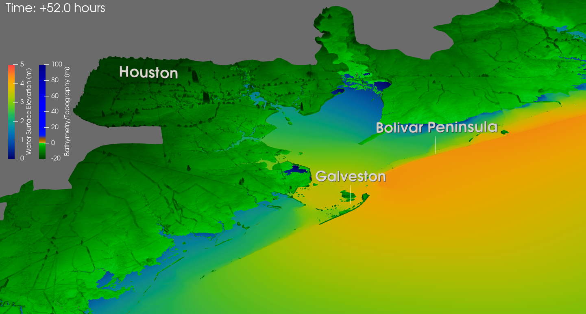
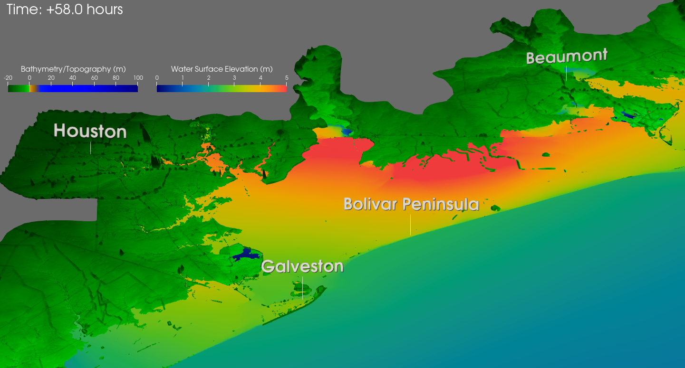

# Visualize ADCIRC results in a 3D view of Houston and surrounding areas

The scripts in this directory should be used with XDMF files that were created using either of:
1. a ``fort.63.nc`` file (XDMF file name:``fort.63.nc.xmf``)
2. a ``maxele.63.nc`` file (XDMF file name:``maxele.63.nc.xmf``) , or 
3. a ``fort.63.nc`` file followed by a ``fort.74.nc`` file (XDMF file name:``fort.63.nc_fort.74.nc.xmf``). Winds data is not used by any of the scripts in this directory, but the scripts have been made compatible with this type of input file regardless for convenience.

The ``time`` script can only be used with the first or third options since it only applies to time series data.

Some brief descriptions of what each file does:
- ``zoomToHouston3D`` and ``zoomToHoustonBeaumont3D``: These scripts zoom in to the area of interest, set color mapping properties, and adjust the location of the color bars.
- ``labelsHouston`` and ``labelsHoustonBeaumont``: Add labels to important locations such as cities/peninsulas/lakes.
- ``timeHouston``: Adds a time annotation relative to the start of the simulation in hours (first timestep will always read +0 hours). Compatible with both the Houston scripts and
the Houston/Beaumont scripts.

## Sample Images
Sample image of all scripts used together for the Houston versions (visualization of Hurricane Ike on TX2020a mesh):

Sample image of all scripts used together for the Houston/Beaumont versions (visualization of Hurricane Ike on TX2020a mesh):

